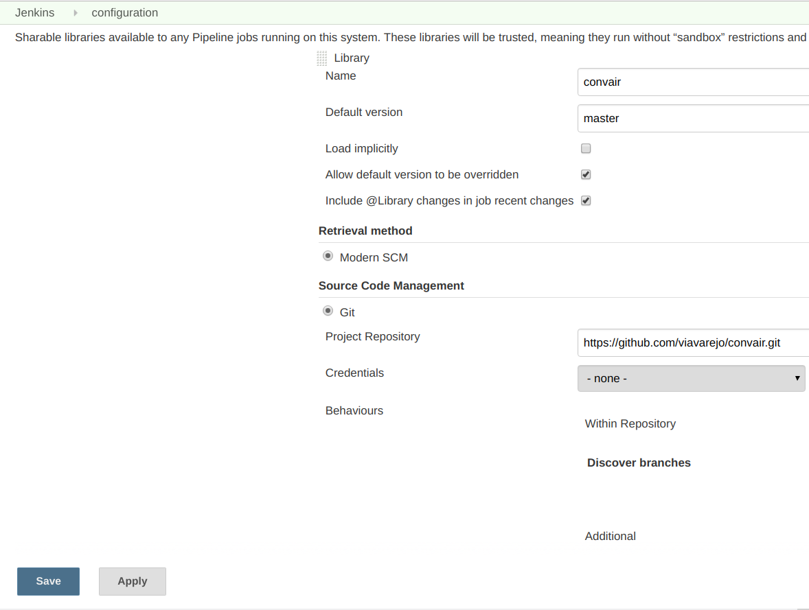
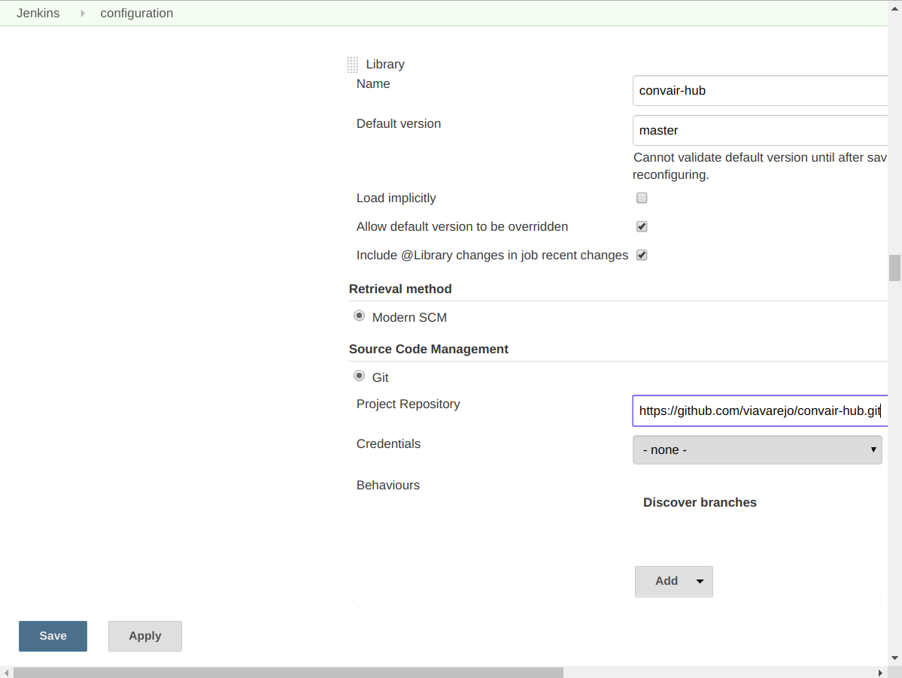

# Convair - A Jenkins Global Library

The idea behind Convair, is to allow full reutilization of Stages throughout teams and organizations.

There are several different projects, that shares common Jenkins Stages, and in an effort to prevent code duplication
and to speed up the development time of Jenkinsfiles, Convair was created to allow developers
to easily invoke standard Stages (Called **ConvairStages** ), and to write their own.

This project is separated in two main pieces:

- Convair Core 
    - The wrapper of the Jenkins Pipeline, that allow us to consume ConvairStages
- [Convair Hub](https://github.com/viavarejo/convair-hub)
    - A public repository filled with standard Stages ready for use.
    
    
You can also create a private repository for your team, to store default Stages specific to your use cases.
All you have to do, is set it as a Shared Library in Jenkins.

## Installation

1. Add the **Convair** repository as a Shared Library in your Jenkins instance

- Manage Jenkins -> Configure System



Add the **Convair Hub** repository as a Shared Library in your Jenkins Instance



## Usage

Create a Jenkinsfile in the root of your repository, and consume all the available tools from this repository

```Groovy
#!/usr/bin/env groovy
@Library("convair") _
@Library("convair-hub")


import br.com.viavarejo.jenkins.stages.maven.*
import br.com.viavarejo.jenkins.stages.git.*

Convair {
  
  variables = [
    NAMESPACE_PREFIX: "myopenshiftnamespace",
    PROJECT_REPO: 'bitbucket.com.br/scm/team/project.git',
    PROJECT_NAME: 'project-name' 
  ]

  selectedAgent = "jenkinsMavenSlave"
  
  selectedStages = [
    
    MavenSetVersion: MavenSetVersion.use(new MavenSetVersionParameters(
        maven: 'M3', 
        mavenSettingsConfig: 'mavenSettings'
    )),
  
    MavenUnitTest: MavenUnitTest.use(),

    MySpecificStage: [
      shouldRun: { true },
      run: {
        println("I can do whatever I want here")
        env.HELLO = 'WORLD'
      }
    ],

    AnotherStage: [
      shouldRun: { env.HELLO == 'WORLD' },
      run: {
        println "Hello ${env.HELLO}"
        env.MAVEN_SONAR = true
      }
    ],


    MavenSonar: MavenSonar.use(new MavenSonarParameters(
        maven: 'M3',
        mavenSettingsConfig: 'mavenSettings'
    ), { env.MAVEN_SONAR }),

  
  ]
  
  onFailure = {
    // Do something in case the pipeline breaks
  }
  
  onSuccess = {
    // Do something in case the pipeline works
  }
  
  always = {
    // Do something, always, regardless of error or success
  }
}
```

## Contributing
Pull requests are welcome. For major changes, please open an issue first to discuss what you would like to change.
